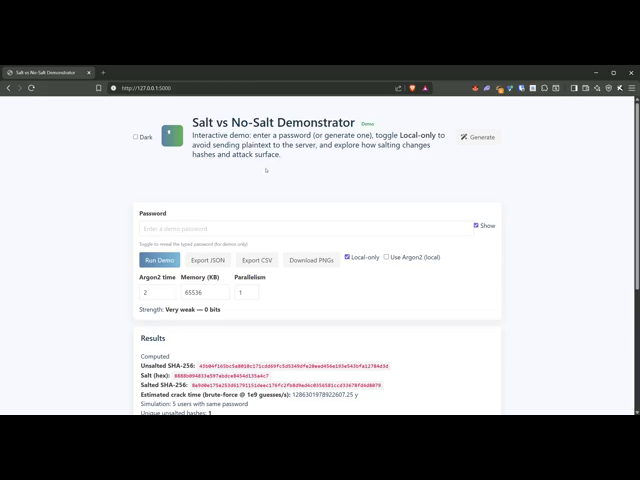
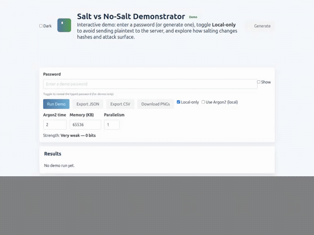

# Salt vs. No-Salt Demonstrator
A quick demo to explore password hashing, salting, and KDFs.  

[](https://github.com/K-Variable7/example-salt/actions/workflows/pytest.yml)
A small demo web app that shows the difference between unsalted and salted password hashing. Intended for educational and local use only.

## Quick start

1. Create a virtual environment and install deps:

```bash
python -m venv .venv
source .venv/bin/activate
pip install -r requirements.txt
```

2. Run the app:

```bash
python app.py
```

3. Open http://127.0.0.1:5000 and paste a few passwords to see the hashes.

## Security notes
- Use only synthetic or permissioned datasets. Do not upload real leaked passwords.
- The demo shows both insecure SHA-256 (unsalted) and salted variants for demonstration. For production, use Argon2/bcrypt/scrypt via well-tested libraries.
- **Local-only mode:** The interactive demo supports a "Local-only" toggle (checked by default). When enabled, all hashing and analysis happen in the browser and **no plaintext is sent to the server**. This is recommended for privacy and demos.

## Next steps
- Add visualizations (crack-time comparisons) — now implemented using Chart.js for crack-time and collision charts
- Add tests and CI (pytest + a GitHub Actions workflow added)
- Visual polish: improved styling (Bulma + custom CSS), icons (Font Awesome), logo, button animations, and result fade-ins

### New features (added)

- **Rainbow-table simulator:** A client-side simulator (under the demo UI) precomputes unsalted hashes for a small, included list of common passwords and shows how unsalted hashes can be cracked instantly using a precomputed table while salted hashes remain unique per user. Use the **"Rainbow-table simulator"** panel to configure users-per-password and toggle the precomputed table.

- **Local KDF toggles (Argon2 / bcrypt / scrypt):** You can now choose to run Argon2, bcrypt, or scrypt locally in the browser to demonstrate per-guess cost. These KDFs are *lazy-loaded* only when selected. Beware that high resource parameters may make your browser unresponsive — the UI shows warnings and timing info when you run them.

If you want a compact demonstration, enable "Local-only" and pick a KDF to see how the estimated crack time increases with work factor and measured compute time.

## KDF tuning — quick how-to 🔧

This short guide helps choose demo-friendly KDF parameters (safe for local demos, not production recommendations):

- **Argon2 (local):** `time` (iterations) and `mem` (KB) increase cost. For demos use `time=1..3` and `mem=32768..131072` (32–128 MB). Beware: high `mem` can freeze browsers; a warning modal appears when memory is large.
- **bcrypt (local):** `rounds` (cost) — each additional round ~doubles compute. Demo-friendly: `8..12` for fast demos; `10` is a reasonable default for demos.
- **scrypt (local):** `N`, `r`, `p` control work/parallelism. Demo defaults: `N=16384`, `r=8`, `p=1`; reduce to `N=1024` and `r=1` for CI/test runs.

How to interpret demo timings:
- The demo measures per-hash time (in seconds) and multiplies by guesses to estimate total crack time (i.e., guesses = 2^(entropy bits)). Use this to show how raising cost parameters increases the estimated crack time dramatically.

⚠️ Reminder: **Do not use real passwords** — the demo is for educational purposes only.

### Running tests locally

Install dev deps: `pip install -r requirements.txt` (includes `pytest` and Playwright tooling).

Run tests:

```bash
pytest -q
```

E2E (Playwright) tests

Install Playwright browsers locally (required for E2E tests):

```bash
python -m playwright install
```

Run E2E tests:

```bash
pytest tests/e2e -q
```

Recording a demo video (for GIF)

You can record a short demo using Playwright and convert the resulting MP4 to GIF via ffmpeg:

1. Record mp4 using the helper script:

```bash
python scripts/record_demo.py --out videos/demo.mp4 --duration 8
```

2. Convert to GIF (requires ffmpeg):

```bash
ffmpeg -ss 0 -t 8 -i videos/demo.mp4 -vf "fps=15,scale=640:-1:flags=lanczos" -loop 0 demo.gif
```

Below is a short demo of the app (Local-only mode). **Privacy note:** the GIF uses synthetic demo passwords and may show them visibly — do not record or commit real passwords. If you prefer, regenerate the GIF with placeholder text.

**Preview:** click the image to open the MP4 preview (GitHub will show it in a player on the MP4 page).

[](videos/demo_preview.mp4)




- Add Argon2 WASM client-side option for stronger local KDF demonstration (implemented). The demo uses a lazy-loaded CDN build of `argon2-browser` when you enable "Use Argon2 (local)" in Local-only mode.
- Added a confirmation modal which warns and requires consent for high Argon2 resource settings (e.g., memory > 256MB).
- Added an export button that downloads the current demo output and chart data as a JSON file.

## Simulation script
A CLI helper is available at `scripts/simulate.py`.

Example usage:

```bash
python scripts/simulate.py --input data/sample_passwords.txt --users 100 --out data/sim_report.json --pretty
```

This will compute unsalted vs salted behavior and write a JSON report to `data/sim_report.json`.
