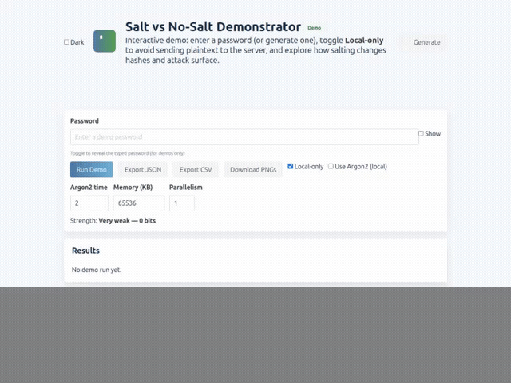

# Salt vs. No-Salt Demonstrator

[](https://github.com/K-Variable7/example-salt/actions/workflows/pytest.yml)
[](https://opensource.org/licenses/MIT)

An interactive web application demonstrating the importance of password salting and key derivation functions (KDFs) for secure hashing. Explore how unsalted vs. salted hashes impact security, visualize crack times, and simulate rainbow table attacks.



## Features

- **Interactive Hashing Demo**: Enter passwords and see unsalted (SHA-256) vs. salted hashes in real-time.
- **Local-Only Mode**: Keep all computations client-side for privacy—no plaintext sent to server.
- **KDF Support**: Experiment with Argon2, bcrypt, and scrypt locally in the browser.
- **Rainbow Table Simulator**: Precomputed unsalted hashes demonstrate instant cracking vulnerabilities.
- **Visualizations**: Charts for estimated crack times and collision counts using Chart.js.
- **Accessibility**: WCAG 2.1 AA compliant with keyboard navigation and screen reader support.
- **Export Options**: Download demo results as JSON, CSV, or PNG charts.

## Quick Start

### Prerequisites
- Python 3.8+
- Virtual environment (recommended)

### Installation

1. Clone the repository:
   ```bash
   git clone https://github.com/K-Variable7/example-salt.git
   cd example-salt
   ```

2. Create and activate a virtual environment:
   ```bash
   python -m venv .venv
   source .venv/bin/activate  # On Windows: .venv\Scripts\activate
   ```

3. Install dependencies:
   ```bash
   pip install -r requirements.txt
   ```

4. Run the application:
   ```bash
   python app.py
   ```

5. Open [http://127.0.0.1:5000](http://127.0.0.1:5000) in your browser.

## Usage

- **Generate a Password**: Click "Generate" for a demo password.
- **Run Demo**: Click "Run Demo" to compute hashes and view results.
- **Toggle Local-Only**: Enable for client-side hashing (recommended for privacy).
- **Enable KDFs**: Select Argon2, bcrypt, or scrypt for advanced demonstrations.
- **Rainbow Simulator**: Adjust users per password and run simulations.

### Security Notes
- **Educational Use Only**: Designed for learning; do not use real passwords.
- **Local-Only Recommended**: Prevents plaintext transmission to the server.
- **Production Standards**: Use Argon2, bcrypt, or scrypt with proper parameters for real applications.

## KDF Tuning Guide

### Argon2 (Recommended)
- **Time (iterations)**: 1–3 for demos; higher increases compute time.
- **Memory (KB)**: 32,768–131,072 (32–128 MB); large values may freeze browsers.
- **Parallelism**: 1–4 lanes; improves throughput on multi-core systems.

### bcrypt
- **Rounds**: 8–12 for demos; each round doubles compute time.
- **Default**: 10 rounds for balanced demo performance.

### scrypt
- **N (work factor)**: 16,384 for demos; reduce to 1,024 for fast CI runs.
- **r (block size)**: 8; affects memory usage.
- **p (parallelization)**: 1; increases parallelism.

## Testing

### Unit & Integration Tests
```bash
pytest -q
```

### End-to-End Tests
1. Install Playwright browsers:
   ```bash
   python -m playwright install
   ```

2. Run E2E tests:
   ```bash
   pytest tests/e2e -q
   ```

## Simulation Script

Run CLI simulations for batch analysis:

```bash
python scripts/simulate.py --input data/sample_passwords.txt --users 100 --out data/sim_report.json --pretty
```

## Contributing

1. Fork the repository.
2. Create a feature branch: `git checkout -b feature-name`.
3. Make changes and add tests.
4. Run tests: `pytest`.
5. Commit and push: `git push origin feature-name`.
6. Open a pull request.

### Development Setup
- Install dev dependencies: `pip install -r requirements.txt` (includes pytest, Playwright).
- Follow the [Contributing Guide](CONTRIBUTING.md) for coding standards.

## License

MIT License - see [LICENSE](LICENSE) file for details.

## Deployment

### Local Development
The app runs on Flask. Follow the Quick Start above.

### Production Deployment
For live deployment, consider platforms like Heroku, Render, or Railway.

#### Heroku Example
1. Create a `Procfile`:
   ```
   web: python app.py
   ```

2. Set environment variables (if needed).

3. Deploy via Heroku CLI or GitHub integration.

#### Render Example
- Connect your GitHub repo.
- Set build command: `pip install -r requirements.txt`
- Set start command: `python app.py`
- Add environment variable: `PORT=10000` (or as configured).

Ensure `app.py` binds to `0.0.0.0` and uses `PORT` from env.
